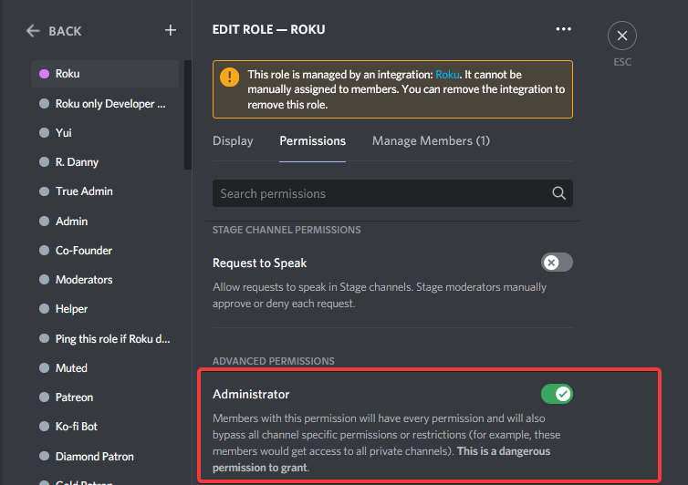

# Frequently Asked Questions (FAQ)

## Invited the bot but its not joining your server/cant see it in your server?

* The bot is lacking perms on the channel. So she wouldn't appear on the member list on that channel.
* Quick fix for this is to go to **Server Settings** > **Roles** > Select **Roku** role and giver her required permissions so she can view all channels and send messages
* If this is hard for you, click on the **Administrator** permission, tick on the **Administrator** permission so she can view all channels!

## What is autorole in Roku? (use-case)

When someone joins a server, Roku will give them role (s) if autorole is configured. For example: everyone humans in Roku's Valley server gets `@online` role and bots get `@Bots` role

### How can I add multiple roles in autorole?

* For humans (aka non-bot users):&#x20;
  * Use `ro autorole human @role1 @role2 @role3`
* For bots (aka bot users):&#x20;
  * Use `ro autorole bot @role1 role2 @role3`&#x20;
* Can I use same autorole for both (humans and bots)?
  * Yes, Use `ro autorole all @role1 @role2`

