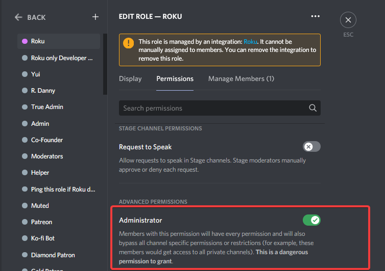

# Frequently Asked Questions \(FAQ\)

## How to setup spawns or turn them off?

**Note the spawns are in development stage**, nevertheless,

 `ro redirect #channel-name` - This will make Roku start spawning cards in that     channel. You can add as many channels as you want.  
  
`ro redirect off` - This will turn off the spawns in that channel.   
  
`ro redirect clear` - This will completely turn off Roku from spawning cards in entire server.   
  
`ro redirect all` - This will make Roku start spawing in all channels

## Why bot doesn't send image in welcome?

You need to turn on **embed** **OR** **image edit** for bot to send welcome image.

## Invited the bot but its not joining your server/cant see it in your server?

* The bot is lacking perms on the channel. So she wouldn't appear on the member list on that channel.
* Quick fix for this is to go to **Server Settings** &gt; **Roles** &gt; Select **Roku** role and tick on the **Administrator** permission so she can view all channels!

## What is autorole in Roku? \(usecase\)

When someone joins a server, Roku will give them role \(s\) if autorole is configured. For example: everyone humans in Roku's Valley server gets `@online` role and bots get `@Bots` role

### How can I add multiple roles in autorole?

* For humans \(aka non-bot users\):        Use `ro autorole human @role1 @role2 @role3`
* For bots \(aka bot users\):        Use `ro autorole bot @role1 role2 @role3`

### Can I use same autorole for both?

**Yes,** Use `ro autorole all @role1 @role2`

